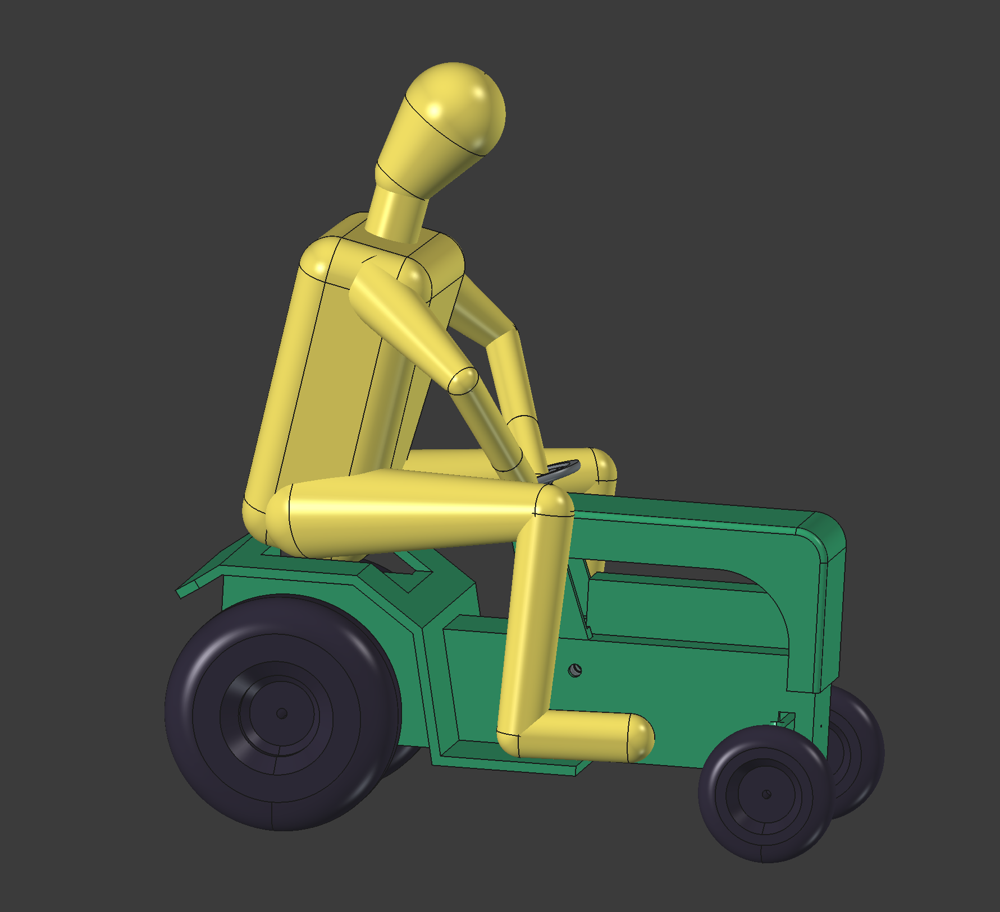

# FreeCAD Mannequin

This is a parametric mannequin for FreeCAD.

See https://www.youtube.com/watch?v=OK1QiW8RkDM for an example of positioning the limbs using the "Transform" tool.

In FreeCAD versions prior to 1.1 the "Transform" tool will rotate around the wrong origin. To work around this, either update to FreeCAD 1.1+, or
manually enter the rotation angle and axis in the property editor. I recommend updating.

To change the size of the mannequin, open up the "S" spreadsheet and change the values in it. The default values are loosely
based off the average male dimensions from https://img.incoherency.co.uk/6376

